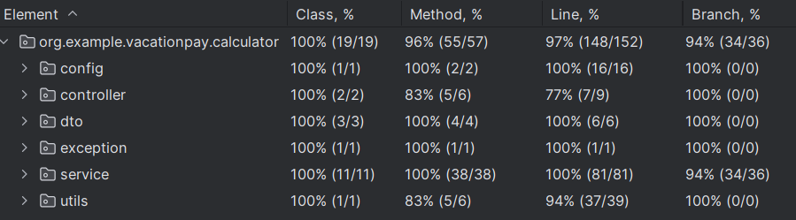

# Neoflex-test-task "VacationPayCalculator"

## Приложение "Калькулятор отпускных". 
### Микросервис на SpringBoot + Java 17 c одним API:
GET "/calculate"

Минимальные требования: Приложение принимает твою среднюю зарплату за 12 месяцев 
и количество дней отпуска - отвечает суммой отпускных, которые придут сотруднику.
Доп. задание: При запросе также можно указать точные дни ухода в отпуск,
тогда должен проводиться рассчет отпускных с учётом праздников и выходных.

При расчете отпускных используется классическая формула - из отпускных 
дней вычитается число праздничных дней, так как они не оплачиваются государством.
Списки праздников разные для каждого из регионов (RU/EU/USA) 
[HolidayDateUtils](src/main/java/org/example/vacationpay/calculator/utils/HolidayDateUtils.java). 
Основной расчет происходит в 
[VacationPayCalculateService](src/main/java/org/example/vacationpay/calculator/service/VacationPayCalculateService.java)
, где средняя зарплата в месяц делится на среднее количество дней в месяце(29.3 дня). Затем это 
число умножается на количество рабочих дней, которое рассчитывается в 
[DaysCalculationService](src/main/java/org/example/vacationpay/calculator/service/days/DaysCalculationService.java).
Потом определяется НДФЛ на основе заработной платы и региона в 
[TaxCalculationService](src/main/java/org/example/vacationpay/calculator/service/tax/TaxCalculationService.java).
В итоге возвращается сумма отпускных за вычетом НДФЛ.

### Ссылка на Сваггер http://localhost:8080/swagger-ui/index.html  
### Ссылка на OAS http://localhost:8080/v3/api-docs

Отчеты по покрытию тестами составили 96%

В данном проекте используется Logback совместно с SLF4J для логирования работы приложения.
Логирование настроено таким образом, чтобы логи выводились в консоль и записывались в файл [app.log](logs/app.log).
Так как логирование использует RollingFileAppender, старые логи автоматически удаляются через 30 дней. 